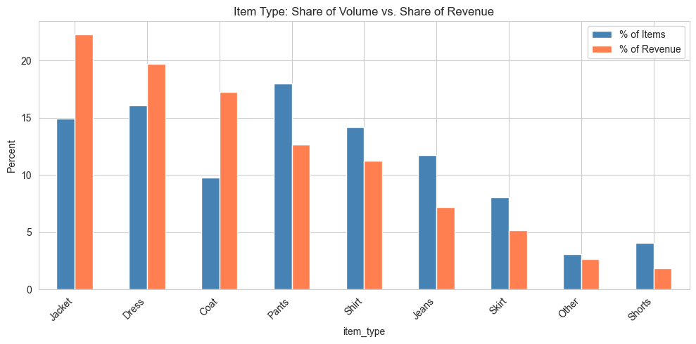
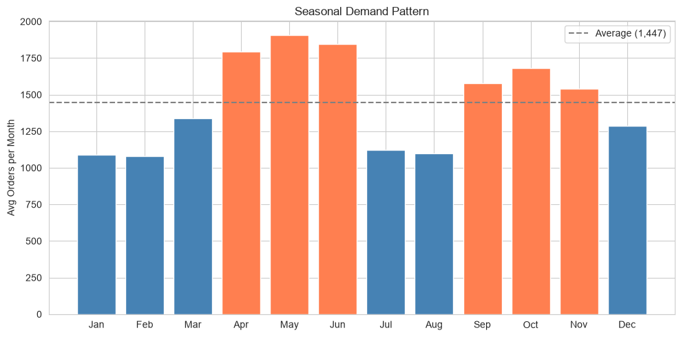
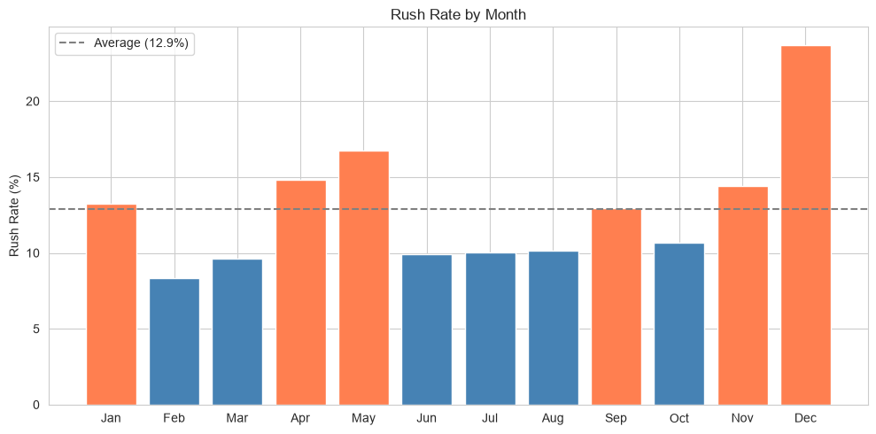
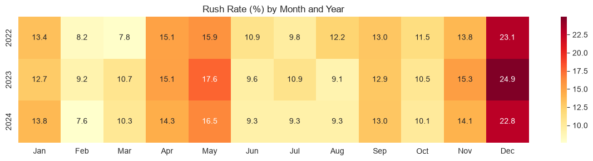

# Pink Slip Management System

A data analysis project built for Anna's Alterations. The web application digitizes paper-based order records through data entry and bulk import, with the primary goal of enabling SQL and Tableau analysis of revenue trends, customer behavior, and seasonal demand.

## Live Demos

- **Web App:** [pinkslip.pythonanywhere.com](https://pinkslip.pythonanywhere.com)
- **Tableau Dashboard:** [Anna's Alterations Dashboard](https://public.tableau.com/views/annas-alterations-dashboard/Dashboard?:language=en-US&:sid=&:redirect=auth&:display_count=n&:origin=viz_share_link)

> This demo uses synthetic sample data spanning 2022 to 2024, simulating realistic order volume, seasonal trends, and customer behavior. All names, phone numbers, and customer details are randomly generated.

## Features

### Web Application
- **Manual data entry:** Add individual pink slips with slip number, customer info, line items (type, description, price), rush fees, and due dates and times.
- **Bulk import:** Upload CSV or Excel files. The app normalizes item types, formats phone numbers, skips duplicates, and reports rejected rows with reasons.
- **Record browsing:** Paginated, searchable view of all slips. Search by slip number, customer name, or phone.
- **CSV export:** Download the full dataset for use in external tools.

### Data Analysis
- **Jupyter notebooks:** `analysis.ipynb` explores customer behavior, revenue trends, and seasonal demand with pandas and matplotlib. `sql_analysis.ipynb` covers the same ground with raw SQL queries.
- **Tableau dashboard:** Interactive visual summaries of key business metrics.

## Tech Stack

| Layer | Technology |
|---|---|
| Backend | Python, Flask, Flask-SQLAlchemy |
| Database | PostgreSQL |
| Data processing | pandas, openpyxl |
| Analysis | Jupyter, SQL |
| Visualization | Tableau |
| Database tooling | DBeaver |

## Analysis Highlights

### Tableau Dashboard

Regular and VIP customers make up 32% of the customer base but drive 64% of revenue. Peak season (April through June) runs about 28% above average, and average order value grew from $30 to $47 over the three year period.

### Daily Revenue Trend

Total revenue across the sample period was $2,050,464, averaging $39.36 per slip and $2,183.67 per day. The visible spikes line up with the spring and fall peaks shown in the [Seasonal Demand](#seasonal-demand-by-month) section below.

### Item Type: Volume vs. Revenue

Jackets, dresses, and coats are the top three categories by revenue (22.3%, 19.7%, and 17.2%), together driving 59.2% of item revenue, however that ranking doesn't match item volume. Pants are the single most common item processed (18.0% of volume) yet rank fourth in revenue (12.6%), reflecting simpler and lower-cost alterations such as hemming. Coats sit at the other end of the spectrum at only 9.8% of volume but the highest average price of any category as it is consistent with more complex and labor-intensive work like relining or structural tailoring.

### Customer Segments

Customer value is heavily concentrated at the top. The 32.1% of customers who visit 5+ times (Regular and VIP combined) generate 64.1% of revenue, while the remaining 67.8% of customers (One-Time and Repeat combined) generate only 35.9%. Within that larger group, Repeat customers make up 47.9% of the customer base but only 31.9% of revenue, the largest segment not yet reaching Regular status, making them the strongest candidate for a loyalty or reminder program. Testing would be needed to confirm outreach actually drives that shift.

### Seasonal Demand by Month

Order volume averages 1,447/month, with a spring peak (April-June) running 28% above average and a smaller fall peak (September-November) at 11% above average. Spring likely reflects wedding and prom/graduation season, while fall lines up with back-to-school, holiday prep, and cold-weather wardrobe changes. Staffing and supplies could be timed to match, stocking up on wedding-related alteration supplies before spring and coat and winter-wear supplies before fall. The slower Jan/Feb and Jul/Aug months could be used for reminder outreach to lapsed customers to help smooth out demand, though this would require opt-in consent for promotional contact since phone numbers are currently collected for order-related purposes only.

This pattern holds across all three years which shows a structural seasonal rhythm rather than a one-off spike. Apr-Jun is the darkest band in 2022, 2023, and 2024. May 2023 is the single busiest month in the dataset at 2,085 orders. Jan/Feb and Jul/Aug are consistently the slowest stretches across all three years.

### Cohort Retention

Customers grouped by the month of their first visit, tracking what percentage returned in that month or any later month. Average month-1 retention is 19.4%, dropping to 16.6% by month 6 and 13.0% by month 12. The steepest drop-off happens right after the first visit, and customers who don't return within that first month rarely return at all, making early outreach the highest-leverage window for retention efforts. Retention also varies by cohort in which customers acquired in Q1 (Jan-Mar) retained best at 24-26% by month 1, while July and November acquisitions retained worst at 14.8-15.1%, with the gap holding out to month 12.

### Rush Rate

Rush rate is the percent of orders in a month that have a rush fee applied. December stands out at a 23.7% rush rate against a 12.9% average. May is a secondary peak at 16.7%, but since it's also the highest-volume month, that lower rate still translates into the most rush orders of any month in absolute terms (319/month on average, vs. 305 in December). February is the quietest month on both fronts at 8.3%. Staffing should flex hardest for May, where volume and urgency compound, with December a close secondary driven by rate alone despite average overall volume.

Breaking the rate down by year confirms it's a stable pattern rather than noise where December ranges 22.8-24.9% and February 7.6-9.2% across all three years. The rest of the year moves in a narrower band (roughly 9-16%), so the holiday rush and the February dip are the two real outliers worth planning around.

## Data Model

Each pink slip has one or more line items.

**pink_slip**

| Column | Type | Description |
|---|---|---|
| id | integer | Primary key |
| slip_number | varchar(6) | Unique slip identifier |
| first_initial | varchar(1) | Customer's first initial |
| last_name | varchar(30) | Customer's last name |
| phone | varchar(16) | Formatted phone number |
| date_received | date | Date the slip was received |
| due_date | date | Typically a 14 day turnaround unless a rush fee applies |
| due_time | varchar(8) | Typically between 10am and 6pm |
| rush_fee | numeric(10,2) | Defaults to $0.00 if not applicable |
| total_amount | numeric(10,2) | Total for the slip |

**pink_slip_item**

| Column | Type | Description |
|---|---|---|
| id | integer | Primary key |
| slip_id | integer | Foreign key to pink_slip |
| item_number | integer | Position on the slip, distinguishes duplicate items |
| item_type | varchar(10) | Shirt, Jeans, Dress, Jacket, Coat, Pants, Skirt, Shorts, or Other |
| work_description | varchar(100) | Includes the item name when type is Other |
| price | numeric(10,2) | Price for this line item |