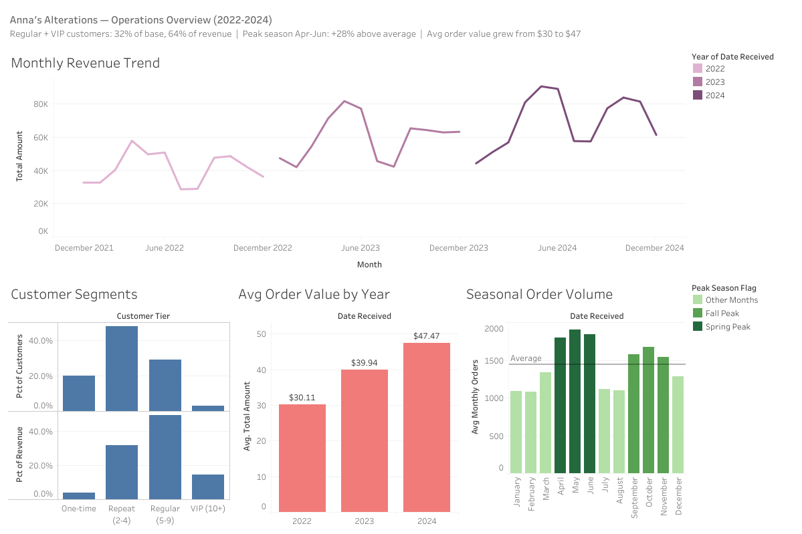
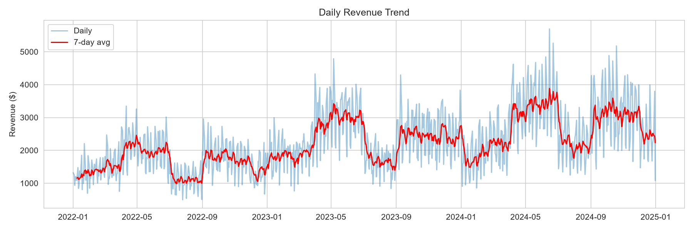
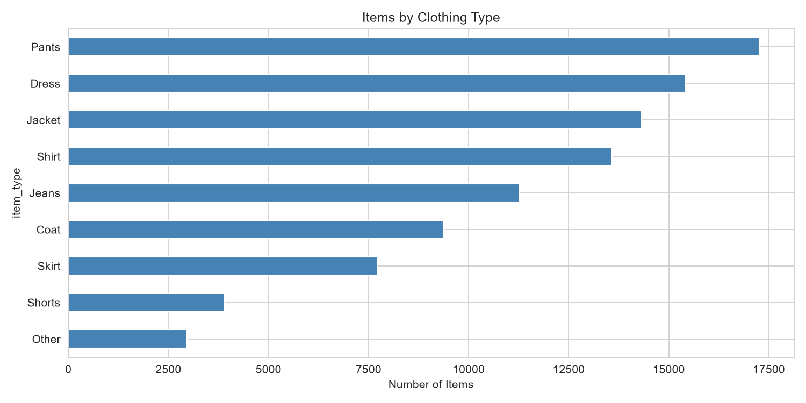
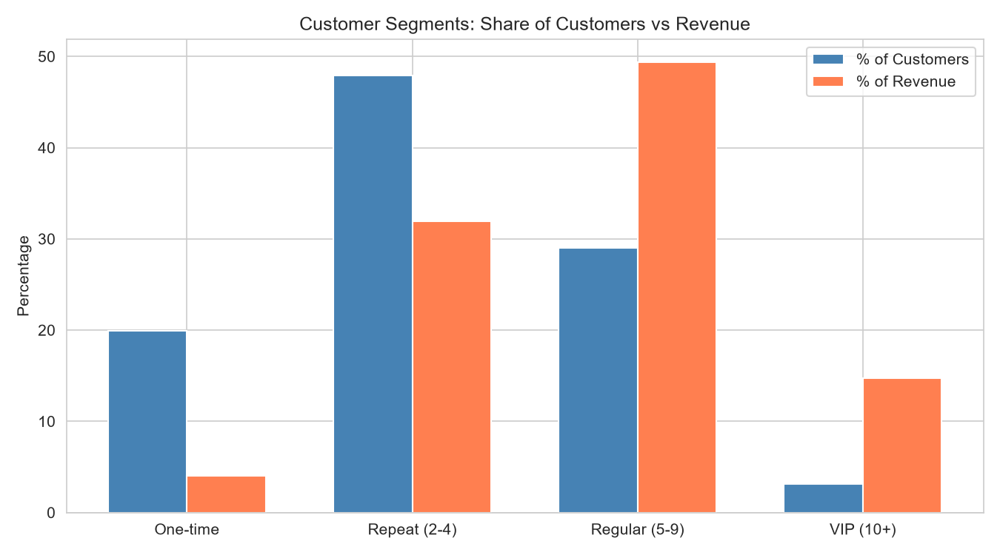
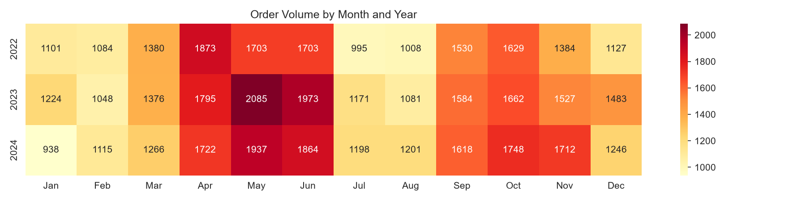
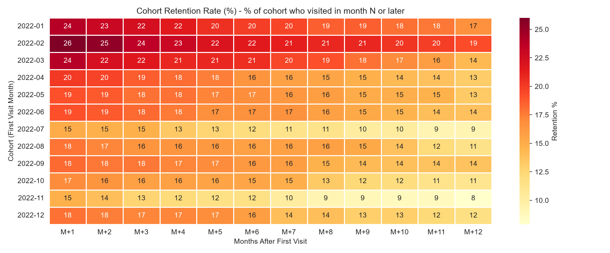

# Pink Slip Management System

A data analysis project built for Anna's Alterations. The web application digitizes paper-based order records through data entry and bulk import, with the primary goal of enabling SQL and Tableau analysis of revenue trends, customer behavior, and seasonal demand.

## Live Demos

- **Web App:** [pinkslip.pythonanywhere.com](https://pinkslip.pythonanywhere.com)
- **Tableau Dashboard:** [Anna's Alterations Dashboard](https://public.tableau.com/views/annas-alterations-dashboard/Dashboard?:language=en-US&:sid=&:redirect=auth&:display_count=n&:origin=viz_share_link)

> This demo uses synthetic sample data spanning 2022 to 2024, simulating realistic order volume, seasonal trends, and customer behavior. All names, phone numbers, and customer details are randomly generated.

## Features

### Web Application
- **Manual data entry:** Add individual pink slips with slip number, customer info, line items (type, description, price), rush fees, and due dates and times.
- **Bulk import:** Upload CSV or Excel files. The app normalizes item types, formats phone numbers, skips duplicates, and reports rejected rows with reasons.
- **Record browsing:** Paginated, searchable view of all slips. Search by slip number, customer name, or phone.
- **CSV export:** Download the full dataset for use in external tools.

### Data Analysis
- **Jupyter notebooks** (`analysis.ipynb`, `sql_analysis.ipynb`): SQL-driven exploration of customer behavior, revenue trends, and seasonal demand.
- **Tableau dashboard:** Interactive visual summaries of key business metrics.

## Tech Stack

| Layer | Technology |
|---|---|
| Backend | Python, Flask, Flask-SQLAlchemy |
| Database | PostgreSQL |
| Data processing | pandas, openpyxl |
| Analysis | Jupyter, SQL |
| Visualization | Tableau |
| Database tooling | DBeaver |

## Analysis Highlights

### Tableau Dashboard

Regular and VIP customers make up 32% of the customer base but drive 64% of revenue. Peak season (April through June) runs about 28% above average, and average order value grew from $30 to $47 over the three year period.

### Daily Revenue Trend

Total revenue across the sample period was $2,050,464, averaging $39.36 per slip and $2,183.67 per day.

### Items by Clothing Type

Pants, dresses, and jackets are the top three categories by volume, together accounting for roughly half of all items processed.

### Customer Segments

Regular customers (5 to 9 visits) make up 29% of the customer base but generate about 49% of revenue, while one-time customers are 20% of customers but only 4% of revenue.

### Seasonal Demand by Month

Order volume peaks in spring (April through June) and again in fall (September through November) across all three years, with spring running about 28% above the yearly average.

### Cohort Retention

Percentage of each month's new customers who returned in a given month or later. Average month-1 retention is 19.4%, dropping to 16.6% by month 6 and 13.0% by month 12.

## Data Model

Each pink slip has one or more line items.

**pink_slip**

| Column | Type | Description |
|---|---|---|
| id | integer | Primary key |
| slip_number | varchar(6) | Unique slip identifier |
| first_initial | varchar(1) | Customer's first initial |
| last_name | varchar(30) | Customer's last name |
| phone | varchar(16) | Formatted phone number |
| date_received | date | Date the slip was received |
| due_date | date | Typically a 14 day turnaround unless a rush fee applies |
| due_time | varchar(8) | Typically between 10am and 6pm |
| rush_fee | numeric(10,2) | Defaults to $0.00 if not applicable |
| total_amount | numeric(10,2) | Total for the slip |

**pink_slip_item**

| Column | Type | Description |
|---|---|---|
| id | integer | Primary key |
| slip_id | integer | Foreign key to pink_slip |
| item_number | integer | Position on the slip, distinguishes duplicate items |
| item_type | varchar(10) | Shirt, Jeans, Dress, Jacket, Coat, Pants, Skirt, Shorts, or Other |
| work_description | varchar(100) | Includes the item name when type is Other |
| price | numeric(10,2) | Price for this line item |